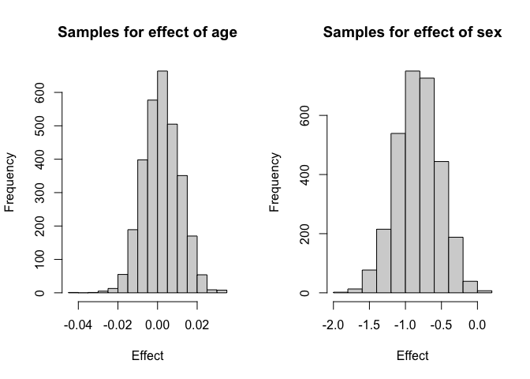

<!-- README.md is generated from README.Rmd. Please edit that file -->

# abcoxp

<!-- badges: start -->
<!-- badges: end -->

The goal of abcoxp is to implement approximate Bayesian inference for
Cox Proportional Hazard model on partial likelihood function, that
accommodates linear fixed effect, nonlinear covariate effect and random
frailty.

## Installation

You can install the development version of this package from
[GitHub](https://github.com/) with:

``` r
# install.packages("devtools")
devtools::install_github("AgueroZZ/abcoxp")
```

## Example

This is a basic example which shows you how to use `abcoxp` to fit and
analyze some models, we consider the following data set of kidney
infection times from the R package `survival`:

``` r
library(abcoxp)
library(dplyr)
library(aghq)
## basic example code
data <- survival::kidney
head(data)
#>   id time status age sex disease frail
#> 1  1    8      1  28   1   Other   2.3
#> 2  1   16      1  28   1   Other   2.3
#> 3  2   23      1  48   2      GN   1.9
#> 4  2   13      0  48   2      GN   1.9
#> 5  3   22      1  32   1   Other   1.2
#> 6  3   28      1  32   1   Other   1.2
```

We can fit a simple fixed effect model with:

``` r
mod <- abcoxp_fit(data = data, 
                  times = "time", # name of your time variable in the data
                  cens = "status", # name of your censoring indicator (0/1) in the data
                  fixed = c("age", "sex"), # names of fixed effect (have to be numeric variables)
                  fixed_control = list(betaprec = 0.001) # the prior distribution for the fixed effects
                  )
```

Once the model is fitted, we can do Bayesian inference by sampling from
its (approximate) posterior with:

``` r
samps <- abcoxp_sampling(fitted_model = mod, # output from abcoxp_fit
                         nsamps = 3000 # number of independent posterior samples to draw
                         )
#> Registered S3 method overwritten by 'LaplacesDemon':
#>   method        from
#>   print.laplace aghq
par(mfrow = c(1,2))
hist(samps$fixed_samps[,1], main = "Samples for effect of age", xlab = "Effect")
hist(samps$fixed_samps[,2], main = "Samples for effect of sex", xlab = "Effect")
```



One can also consider adding a group-level frailty and a nonlinear
covariate effect with continuous second order random walk (RW2)
covariance with:

``` r
mod <- abcoxp_fit(data = data, 
                  times = "time", # name of your time variable in the data
                  cens = "status", # name of your censoring indicator (0/1) in the data
                  fixed = c("sex"), # names of fixed effect (have to be numeric variables)
                  fixed_control = list(betaprec = 0.001), # the prior distribution for the fixed effects
                  frailty = "id", # name of the group variable for frailty, has to be integer valued
                  RW2 = "age", # name of the RW2 variable, has to be numeric valued
                  frailty_control = list(u = 1, alpha = 0.5), # PC prior parameters for frailty SD
                  RW2_control = list(u = 1, alpha = 0.5, r = 30), # PC prior paramters for RW2 SD, and # of knots
                  Inference_control = list(aghq_k = 4) # number of grid points to use for the AGHQ
                  )
```

The posterior for the two hyperparameters (theta1 for SD of frailty and
theta2 for SD of RW2) can be plotted by:

``` r
par(mfrow = c(2,2))
plot(mod$model)
```


Similarly the posterior samples can be obtained with:

``` r
samps <- abcoxp_sampling(fitted_model = mod, # output from abcoxp_fit
                         nsamps = 3000 # number of independent posterior samples to draw
                         )
```

The variable `samps$RW2_values_samps` has posterior sample paths for the
nonlinear covariate effect:

``` r
pos_samp_path <- samps$RW2_values_samps
mean <- pos_samp_path[,-1] %>% apply(1, mean) # The first column is the covariate values, not sample path!
upper <- pos_samp_path[,-1] %>% apply(1, quantile, p = 0.975)
lower <- pos_samp_path[,-1] %>% apply(1, quantile, p = 0.025)
plot(mean ~ pos_samp_path$x, type = 'l', ylim = c(-1,1), xlab = "age", ylab = "Effect")
lines(upper ~ pos_samp_path$x, lty = 'dashed')
lines(lower ~ pos_samp_path$x, lty = 'dashed')
```


To replicate the analysis in the main paper , we can do the following:

``` r
data <- survival::kidney
data$GN <- ifelse(data$disease == "GN", 1, 0)
data$AN <- ifelse(data$disease == "AN", 1, 0)
data$PKD <- ifelse(data$disease == "PKD", 1, 0)
data$sex <- (data$sex - 1)

mod <- abcoxp_fit(data = data, 
                  times = "time", # name of your time variable in the data
                  cens = "status", # name of your censoring indicator (0/1) in the data
                  fixed = c("sex", "age", "GN", "AN", "PKD"), # names of fixed effect (have to be numeric variables)
                  fixed_control = list(betaprec = 0.001), # the prior distribution for the fixed effects
                  frailty = "id", # name of the group variable for frailty, has to be integer valued
                  frailty_control = list(u = 2, alpha = 0.5), # PC prior parameters for frailty SD
                  Inference_control = list(aghq_k = 15) # number of grid points to use for the AGHQ
                  )
```

The posterior of the frailty log precision *θ*<sub>*ξ*</sub> can be
obtained as:

``` r
par(mfrow = c(1,2))
plot(mod$model)
```


This can be converted to the posterior of the SD parameter
*σ*<sub>*ξ*</sub> as:

``` r
prec_marg <- mod$model$marginals[[1]]
logpostsigma <- compute_pdf_and_cdf(prec_marg,list(totheta = function(x) -2*log(x),fromtheta = function(x) exp(-x/2)),interpolation = 'spline')
```

The posterior distribution of each parameter can be obtained as:

``` r
samps <- abcoxp_sampling(fitted_model = mod, # output from abcoxp_fit
                         nsamps = 10000 # number of independent posterior samples to draw
                         )

### Plot density:
sex_proposed_dens <- density(samps$fixed_samps[,1], bw = 0.1)
sex_proposed_dens <- tibble(x = sex_proposed_dens$x, y = sex_proposed_dens$y)
age_proposed_dens <- density(samps$fixed_samps[,2], bw = 0.005)
age_proposed_dens <- tibble(x = age_proposed_dens$x, y = age_proposed_dens$y)
GN_proposed_dens <- density(samps$fixed_samps[,3], bw = 0.12)
GN_proposed_dens <- tibble(x = GN_proposed_dens$x, y = GN_proposed_dens$y)
AN_proposed_dens <- density(samps$fixed_samps[,4], bw = 0.12)
AN_proposed_dens <- tibble(x = AN_proposed_dens$x, y = AN_proposed_dens$y)
PKD_proposed_dens <- density(samps$fixed_samps[,5], bw = 0.2)
PKD_proposed_dens <- tibble(x = PKD_proposed_dens$x, y = PKD_proposed_dens$y)
```

``` r
par(mfrow = c(2,3))
with(logpostsigma,plot(transparam,pdf_transparam,type='l',xlim = c(0,3), ylab = "density", xlab = "SD"))
plot(sex_proposed_dens, type = 'l', xlab = "sex", ylab = "density")
plot(age_proposed_dens, type = 'l', xlab = "age", ylab = "density")
plot(GN_proposed_dens, type = 'l', xlab = "GN", ylab = "density")
plot(AN_proposed_dens, type = 'l', xlab = "AN", ylab = "density")
plot(PKD_proposed_dens, type = 'l', xlab = "PKD", ylab = "density")
```


